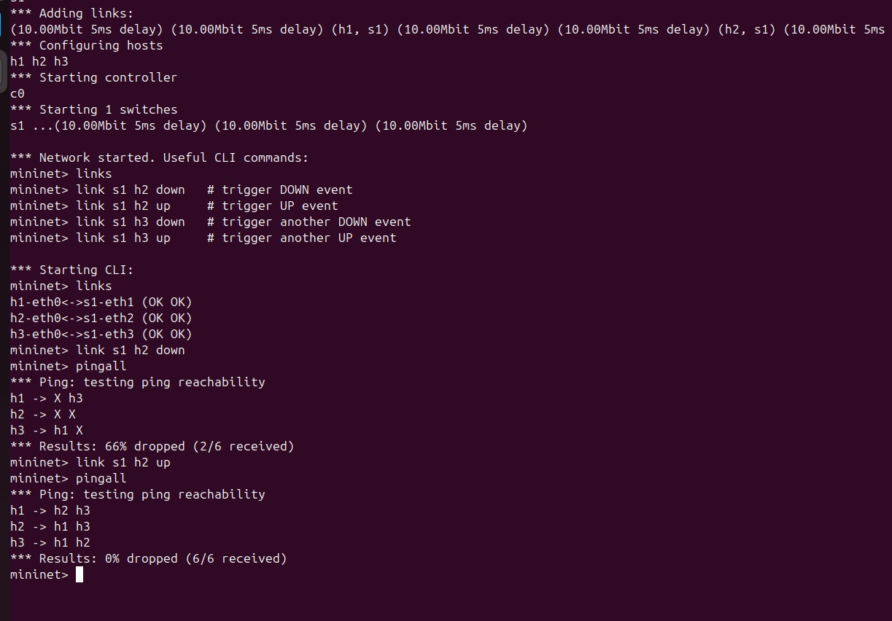

# SDN Port Status Monitoring Tool

## Problem Statement
This project implements an SDN-based Port Status Monitoring Tool using Mininet and a POX OpenFlow controller.

The objective is to:
- Detect switch port up and down events
- Log port status changes
- Generate alert messages for failures
- Display current port status at the controller

## Setup/Execution Steps
1. Install dependencies:
```bash
sudo apt update
sudo apt install -y mininet openvswitch-switch wireshark iperf git
```

2. Clone POX in the project root:
```bash
cd /home/adi/cn_sdn_project
git clone https://github.com/noxrepo/pox.git
```

The controller run script automatically links the app to `pox/pox/ext/port_status_monitor.py`.

3. Start controller (terminal 1):
```bash
cd /home/adi/cn_sdn_project
bash scripts/run_controller.sh
```

4. Start topology (terminal 2):
```bash
cd /home/adi/cn_sdn_project
bash scripts/run_topology.sh
```

5. Trigger port events in Mininet CLI:
```bash
link s1 h2 down
link s1 h2 up
link s1 h3 down
link s1 h3 up
```

6. Check log file output:
```bash
tail -n 50 logs/port_events.log
```

7. Collect traffic-test outputs for proof:
```bash
pingall
```

## Expected Output
- Controller shows switch connection and live STATUS lines for ports.
- During `link ... down`, an `ALERT` entry is generated.
- During `link ... up`, an `INFO` entry is generated.
- `logs/port_events.log` contains timestamped records of each status transition.
- Ping and command outputs are visible from Mininet CLI and can be recorded as results.

## Proof of Execution

.jpeg)
.jpeg)
.jpeg)
